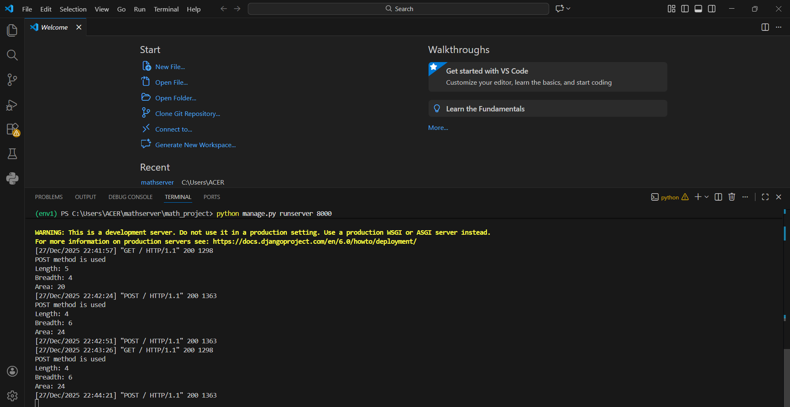
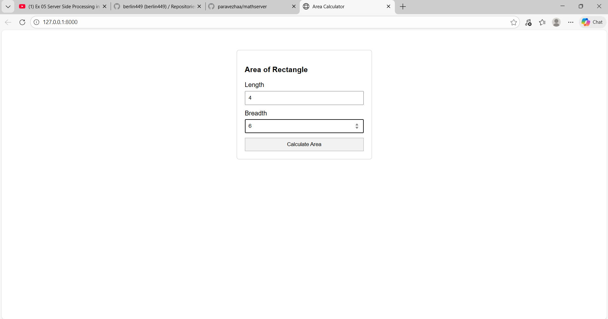
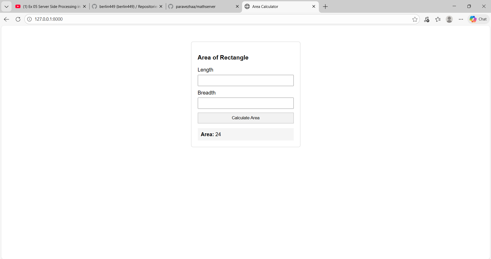

# Ex.05 Design a Website for Server Side Processing
# Date: 27.11.2025
# AIM:
To design a website to calculate the power of a lamp filament in an incandescent bulb in the server side.

# FORMULA:
P = I2R
P --> Power (in watts)
 I --> Intensity
 R --> Resistance

# DESIGN STEPS:
## Step 1:
Clone the repository from GitHub.

## Step 2:
Create Django Admin project.

## Step 3:
Create a New App under the Django Admin project.

## Step 4:
Create python programs for views and urls to perform server side processing.

## Step 5:
Create a HTML file to implement form based input and output.

## Step 6:
Publish the website in the given URL.

# PROGRAM :
```
math.html

<!DOCTYPE html>
<html>
<head>
    <title>Area Calculator</title>
    <style>
        body {
            font-family: Arial, sans-serif;
            background: #ffffff;
        }
        .box {
            width: 300px;
            margin: 50px auto;
            border: 1px solid #ccc;
            padding: 20px;
            border-radius: 6px;
        }
        input {
            width: 100%;
            padding: 8px;
            margin: 6px 0 12px 0;
            box-sizing: border-box;
        }
        button {
            padding: 8px;
            width: 100%;
            background: #f2f2f2;
            border: 1px solid #aaa;
            cursor: pointer;
        }
        .result {
            margin-top: 15px;
            background: #f5f5f5;
            padding: 10px;
        }
    </style>
</head>
<body>

<div class="box">
    <h3>Area of Rectangle</h3>

    <form method="post">
        

        <label>Length</label>
        <input type="number" name="length" required>

        <label>Breadth</label>
        <input type="number" name="breadth" required>

        <button type="submit">Calculate Area</button>
    </form>

    
    <div class="result">
        <b>Area:</b> {{ area }}
    </div>
    
</div>

</body>
</html>

views.py

rom django.shortcuts import render

def rectarea(request):
    context = {}
    context['area'] = 0
    context['l'] = 0
    context['b'] = 0

    if request.method == "POST":
        print("POST method is used")

        l = request.POST.get('length', '0')
        b = request.POST.get('breadth', '0')

        print("Length:", l)
        print("Breadth:", b)

        area = int(l) * int(b)

        context['area'] = area
        context['l'] = l
        context['b'] = b

        print("Area:", area)

    return render(request, "math.html", context)

    urls.py

    from django.contrib import admin
from django.urls import path
from mathapp import views

urlpatterns = [
    path('admin/', admin.site.urls),
    path('areaofrectangle/', views.rectarea, name='areaofrectangle'),
    path('', views.rectarea, name='areaofrectangleroot'),
]
```
# SERVER SIDE PROCESSING:

# HOMEPAGE:


# RESULT:
The program for performing server side processing is completed successfully.
